# Informe de laboratorio — ToDo Full Stack (Laboratorio 6 DOSW)

## 1. Integrante

Natalia Andrea Rodriguez Torres

## 2. Enlace al repositorio

https://github.com/nataliaRT12/DOSW_LAB6_Rodriguez

## 3. Descripción de la solución

La aplicación ToDo permite gestionar tareas personales (crear, consultar, editar, cambiar de estado y eliminar) desde una interfaz web en React que consume una API REST construida con Spring Boot 4 y Java 21. La información se persiste en PostgreSQL 17, ejecutado en un contenedor Docker.

El backend expone los endpoints bajo `/api/v1/tasks`, valida los datos de entrada, asigna valores por defecto al crear una tarea (`status = PENDING`, `priority = MEDIUM` si no se especifica) y maneja errores de forma centralizada devolviendo códigos HTTP apropiados. Una clase de configuración (`WebConfig`) habilita CORS para el origen `http://localhost:5173`, de modo que el navegador permita las llamadas del frontend a la API. El frontend consume esa API mediante `fetch`, mantiene el estado de las tareas con `useState`/`useEffect` en un hook dedicado (`useTasks`), y permite crear, editar, cambiar de estado y eliminar tareas desde formularios y listas reutilizables.

Ambas capas cuentan con pruebas automatizadas: JUnit 5, Mockito y AssertJ en el backend (con cobertura medida por JaCoCo), y Vitest con React Testing Library en el frontend.

## 4. Arquitectura final de la aplicación

```
React (UI)
   │  fetch (JSON sobre HTTP)
   ▼
TaskController (REST)
   │
   ▼
TaskService / TaskServiceImpl
   │
   ▼
TaskRepository (Spring Data JPA)
   │
   ▼
TaskEntity (Hibernate / JPA)
   │
   ▼
PostgreSQL (contenedor Docker)
```

- **Backend**: `backend/src/main/java/edu/eci/dosw/todo/` dividido en `controller`, `service`, `repository`, `entity`, `dto`, `exception` y `config`.
- **Frontend**: `frontend/src/` dividido en `api` (cliente HTTP), `features/tasks/hooks` (estado), `features/tasks/components` (UI) y `features/tasks/pages` (composición de pantalla).
- **Base de datos**: esquema definido en `database/001_create_schema.sql`, aplicado sobre un contenedor PostgreSQL con volumen persistente.

## 5. Evidencias principales de funcionamiento

Las capturas se encuentran en `docs/evidence/`.

### Evidencia 01 · PostgreSQL en Docker

Imagen `postgres:17-alpine` descargada y contenedor `todo-postgres` en ejecución.

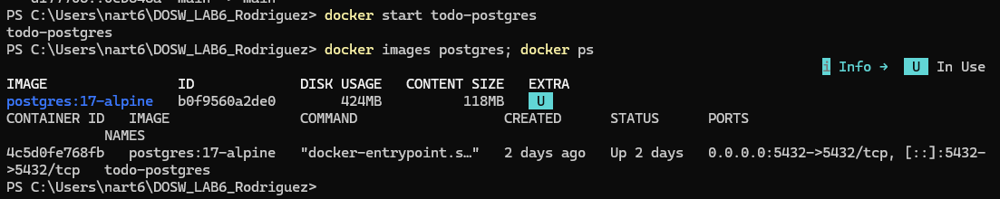

### Evidencia 02 · Tabla `tasks`

Tabla creada con el script `database/001_create_schema.sql` dentro del contenedor.

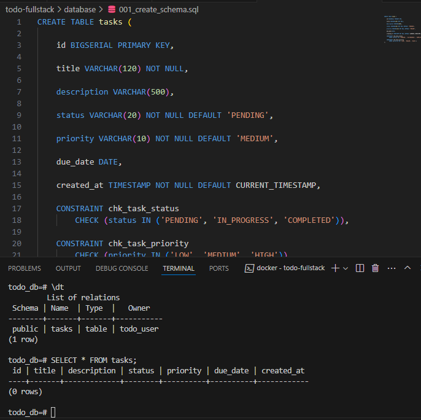

### Evidencia 03 · Pruebas del Service

`TaskServiceTest`: 9 pruebas, 0 fallos.

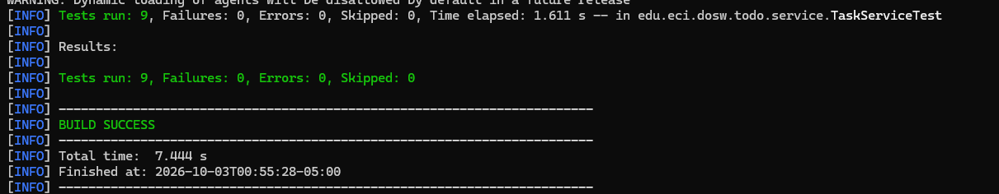

### Evidencia 04 · Pruebas del Controller

`TaskControllerTest`: 9 pruebas, 0 fallos.

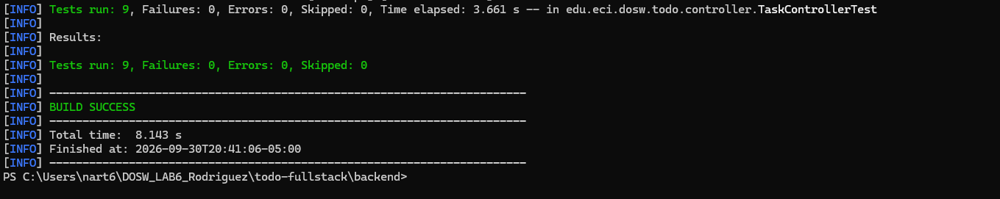

### Evidencia 05 · Reporte de cobertura JaCoCo

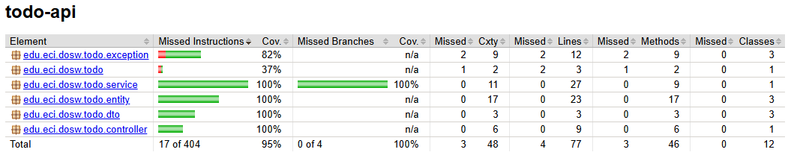

El reporte de JaCoCo muestra:

- `edu.eci.dosw.todo.service`: 100% de cobertura de instrucciones y de ramas.
- `edu.eci.dosw.todo.controller`, `edu.eci.dosw.todo.entity` y `edu.eci.dosw.todo.dto`: 100% de cobertura de instrucciones.
- `edu.eci.dosw.todo.exception`: 82% de cobertura de instrucciones. Los métodos `handleUnreadable` (cuerpo JSON mal formado o enum inválido) y `handleTypeMismatch` (identificador que no es numérico) no tienen una prueba específica; los manejadores de 404 y de validación (400) sí están cubiertos.
- `edu.eci.dosw.todo`: 37%, porque la clase `TodoApiApplication` solo tiene el método `main`, que no se ejecuta en las pruebas.
- Cobertura total del proyecto: 95% de instrucciones (17 de 404 sin cubrir) y 100% de ramas, ambas por encima de la meta del 80% sugerida por el laboratorio.

### Evidencia 06 · API funcionando

Peticiones a `/api/v1/tasks`: creación (201), listado y consulta por id (200), actualización (200), eliminación (204) y consulta de un id inexistente (404 con el cuerpo `{"status":404,"message":"Task with id 99 was not found"}`).

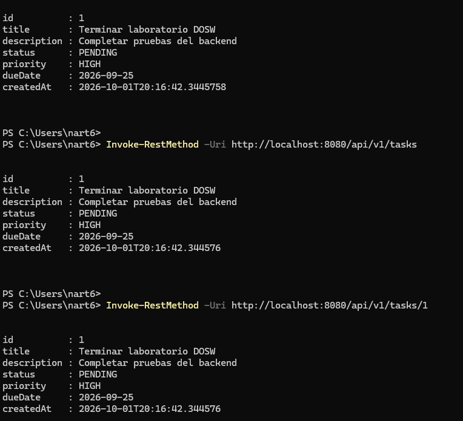

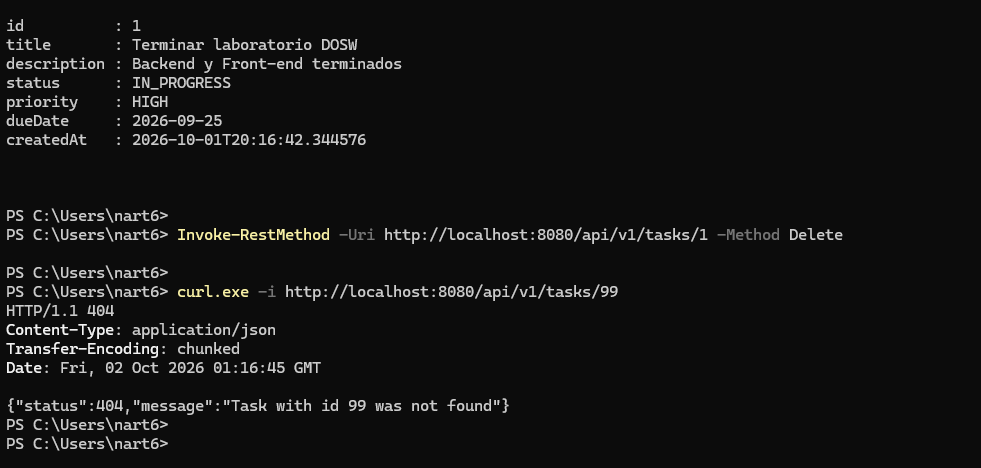

### Evidencia 07 · Aplicación React

Interfaz cargada desde `http://localhost:5173`, sin tareas registradas.

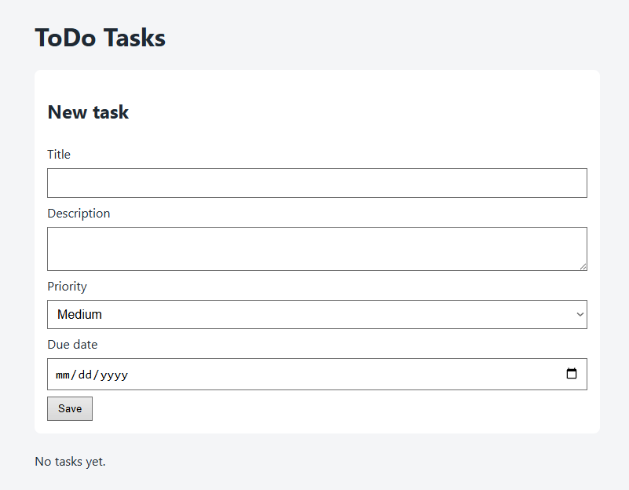

### Evidencia 08 · Creación desde React

Formulario con los datos de una tarea nueva y la lista después de guardarla.

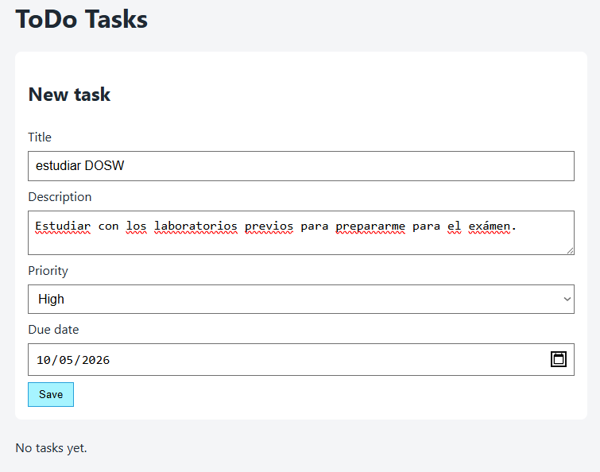

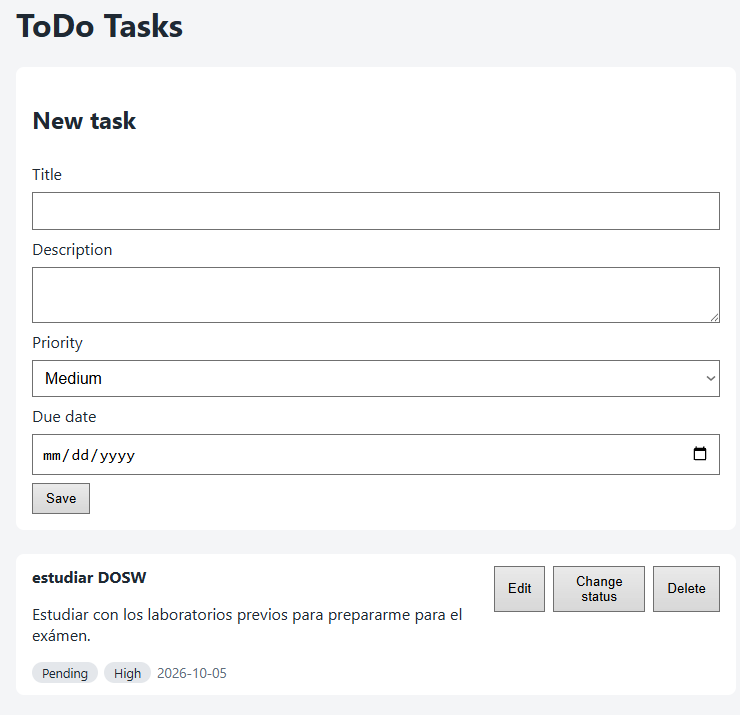

### Evidencia 09 · Edición desde React

Tarea en estado `Pending`, formulario de edición con el estado cambiado a `In progress` y la tarea ya actualizada.

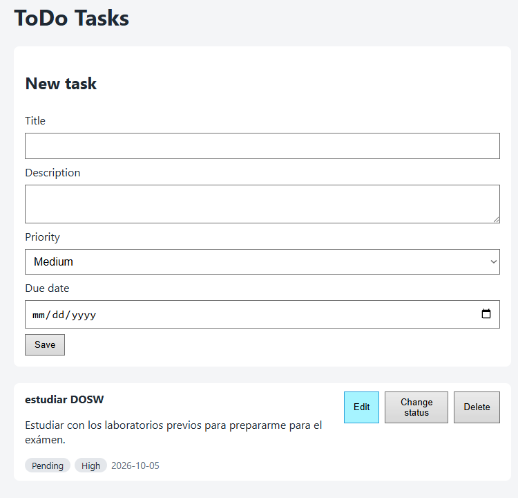

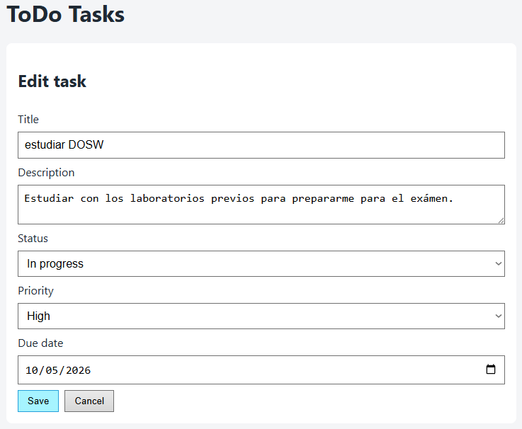

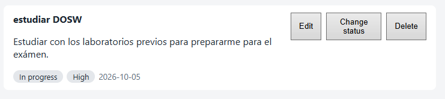

### Evidencia 10 · Eliminación desde React

Lista con dos tareas y la lista después de eliminar `revisar correo`.

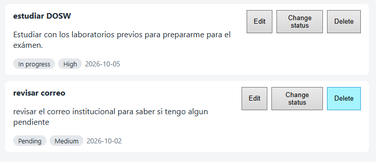

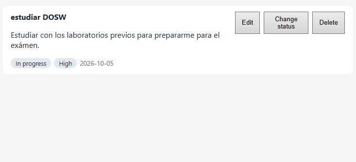

### Evidencia 11 · Pruebas del frontend

Vitest: 3 archivos de prueba y 13 pruebas exitosas.

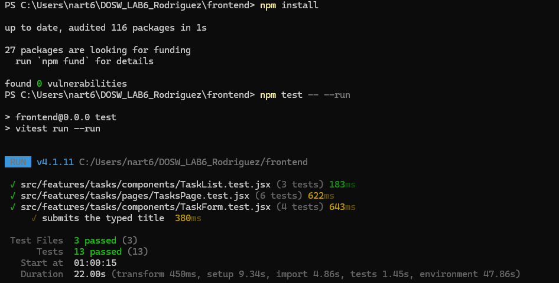

## 6. Resultados de las pruebas

**Backend** (`mvn clean verify`):

- `TaskServiceTest`: 9 pruebas, 0 fallos.
- `TaskControllerTest`: 9 pruebas, 0 fallos.
- `TodoApiApplicationTests`: 1 prueba (`contextLoads`), 0 fallos (requiere el contenedor de PostgreSQL levantado).
- Total: 19 pruebas, `BUILD SUCCESS`.
- Reporte de cobertura generado con JaCoCo: 95% de instrucciones, 100% de ramas.

**Frontend** (`npm test`):

- `TaskForm.test.jsx`: 4 pruebas.
- `TaskList.test.jsx`: 3 pruebas.
- `TasksPage.test.jsx`: 6 pruebas.
- Total: 13 pruebas, todas exitosas.

## 7. Respuestas a las preguntas de análisis

### Arquitectura

**1. ¿Qué sucede desde que el usuario presiona "Guardar tarea" hasta que queda almacenada en PostgreSQL?**

El formulario de React (`TaskForm`) construye un objeto con los datos ingresados y lo pasa a `addTask` del hook `useTasks`, que llama a `createTask` en `taskApi.js`. Esta función hace un `fetch` `POST` a `/api/v1/tasks` con el cuerpo en JSON. `TaskController` recibe la petición, valida el DTO (`TaskCreateRequest`) con `@Valid`, y delega en `TaskServiceImpl.create()`. El servicio construye una `TaskEntity`, asigna los valores por defecto (`status = PENDING`, `priority = MEDIUM` si no vino otra, `createdAt = now()`) y la pasa a `TaskRepository.save()`. Spring Data JPA, a través de Hibernate, genera el `INSERT` y lo ejecuta contra PostgreSQL. El resultado guardado se transforma de vuelta a `TaskResponse` y viaja como JSON hasta React, donde `useTasks` vuelve a cargar la lista para reflejar el cambio.

**2. ¿Qué responsabilidad tiene cada capa?**

- `Controller`: recibe las peticiones HTTP, valida la forma de los datos de entrada y traduce el resultado del Service a respuestas HTTP con el código adecuado.
- `Service`: contiene la lógica de negocio (valores por defecto, validación de existencia, orquestación de las operaciones) y es el único punto que conoce tanto los DTOs como las entidades.
- `Repository`: abstrae el acceso a datos; en este proyecto es una interfaz de Spring Data JPA sin lógica propia.
- `Entity`: representa la tabla `tasks` y su mapeo objeto-relacional.
- `DTO`: define qué datos entran y salen de la API, evitando exponer directamente la entidad JPA.

**3. ¿Por qué el frontend no se conecta directamente a PostgreSQL?**

Porque el navegador no puede abrir conexiones JDBC ni hablar el protocolo de PostgreSQL, y porque hacerlo expondría las credenciales de la base de datos en el código del cliente. La API REST actúa como una capa intermedia controlada, que valida, autoriza y transforma los datos antes de tocar la base de datos.

**4. ¿Qué problema habría si el Controller accediera directamente al Repository y tuviera la lógica de negocio?**

Se perdería la separación de responsabilidades: el Controller terminaría mezclando el manejo de HTTP con las reglas de negocio (valores por defecto, validaciones, manejo de errores de dominio), lo que dificultaría probar la lógica de forma aislada (ya no se podría usar `MockMvc` sin levantar reglas de negocio) y reutilizarla desde otro punto de entrada. También aumentaría el acoplamiento entre la capa web y la capa de persistencia.

### Persistencia

**5. ¿Cómo se relaciona `TaskEntity` con la tabla `tasks`?**

`TaskEntity` está anotada con `@Entity` y `@Table(name = "tasks")`, y cada atributo se mapea a una columna mediante `@Id`, `@GeneratedValue(strategy = GenerationType.IDENTITY)` para `id`, `@Column` para los campos simples (incluyendo el renombrado de `dueDate` a `due_date` y `createdAt` a `created_at`), y `@Enumerated(EnumType.STRING)` para `status` y `priority`, de modo que los enums se almacenan como texto y no como índices numéricos.

**6. ¿Qué papel cumplen JPA, Hibernate y Spring Data JPA?**

JPA es la especificación que define cómo mapear objetos Java a tablas relacionales. Hibernate es la implementación concreta que traduce esas anotaciones en sentencias SQL reales contra PostgreSQL. Spring Data JPA se apoya en Hibernate para generar automáticamente la implementación de repositorios (como `TaskRepository`) a partir de una interfaz, sin necesidad de escribir SQL ni código de acceso a datos manual.

**7. ¿Qué operaciones del CRUD da `JpaRepository` sin implementarlas?**

Al extender `JpaRepository<TaskEntity, Long>`, `TaskRepository` obtiene automáticamente `save()`, `findById()`, `findAll()`, `existsById()`, `deleteById()` y variantes con paginación, sin escribir una sola línea de implementación.

**8. ¿Por qué se usó `ddl-auto=validate` en vez de dejar que Hibernate cree el esquema?**

Porque el esquema de la base de datos se define explícitamente en `database/001_create_schema.sql`, incluyendo restricciones (`CHECK` sobre `status` y `priority`) que Hibernate no replicaría automáticamente. `validate` hace que Hibernate compare el mapeo de las entidades contra el esquema real y falle si no coinciden, evitando que la aplicación modifique la estructura de la base de datos por accidente y asegurando que el esquema en producción sea siempre el definido explícitamente por el equipo.

### API REST

**9. Método HTTP usado en cada operación del CRUD:**

- Crear → `POST`: no es idempotente y crea un nuevo recurso.
- Consultar → `GET`: es una operación de solo lectura, segura e idempotente.
- Actualizar → `PUT`: reemplaza el estado completo del recurso identificado por su `id`, y es idempotente (repetirla produce el mismo resultado).
- Eliminar → `DELETE`: elimina el recurso identificado por su `id`, también idempotente.

**10. Diferencia entre los códigos de estado usados:**

- `200 OK`: la petición se procesó correctamente y devuelve un cuerpo (usado en `GET` y `PUT`).
- `201 Created`: se creó un nuevo recurso (usado en `POST`), e incluye el recurso creado en el cuerpo.
- `204 No Content`: la operación fue exitosa pero no hay nada que devolver (usado en `DELETE`).
- `400 Bad Request`: la petición del cliente es inválida (por ejemplo, título vacío), el error está en los datos enviados.
- `404 Not Found`: el recurso solicitado no existe (`id` inexistente).
- `500 Internal Server Error`: un fallo no controlado del servidor; en esta aplicación no debería ocurrir para los casos cubiertos, porque los errores previstos ya se traducen a 400 o 404 mediante `GlobalExceptionHandler`.

**11. ¿Qué información intercambian React y Spring Boot y en qué formato?**

Intercambian los datos de las tareas (título, descripción, estado, prioridad, fecha límite, identificador, fecha de creación) serializados como JSON en el cuerpo de las peticiones y respuestas HTTP, usando el header `Content-Type: application/json`.

### React

**12. ¿Qué responsabilidad tiene `taskApi.js`?**

Centraliza toda la comunicación HTTP con el backend: construye las URLs, arma las peticiones `fetch` con el método y cuerpo correctos, y procesa la respuesta (incluyendo el manejo de errores con los mensajes que entrega `GlobalExceptionHandler`). Ningún componente llama a `fetch` directamente; todos pasan por este módulo.

**13. ¿Para qué se usó `useState`?**

Para mantener el estado local de la interfaz: la lista de tareas, si está cargando, el mensaje de error, los valores de cada campo del formulario y qué tarea se está editando en un momento dado.

**14. ¿Para qué se usó `useEffect`?**

Dentro de `useTasks`, para disparar la carga inicial de tareas (`loadTasks()`) en el momento en que el componente se monta, sin que el usuario tenga que pedirlo explícitamente.

**15. ¿Cómo se actualiza la pantalla después de crear, editar o eliminar una tarea?**

Cada operación (`addTask`, `editTask`, `removeTask`) llama primero a la API y, una vez resuelta, vuelve a invocar `loadTasks()`, que trae la lista actualizada desde el backend y reemplaza el estado `tasks`. Como React vuelve a renderizar cuando cambia el estado, la lista en pantalla queda sincronizada con lo que realmente hay en la base de datos, sin necesidad de actualizar manualmente un elemento específico.

### Docker y PostgreSQL

**16. Ventaja de usar la imagen oficial de PostgreSQL en Docker en vez de instalarlo en cada equipo:**

Cualquier persona que clone el repositorio corre exactamente la misma versión de PostgreSQL (17-alpine), sin depender de instalaciones distintas en cada sistema operativo. Levantar o eliminar la base de datos es un comando, no un proceso de instalación, y no deja residuos ni configuraciones globales en la máquina.

**17. Diferencia entre `docker pull`, `docker run`, `docker stop`, `docker start`, `docker exec`:**

- `docker pull`: descarga una imagen desde un registro (Docker Hub) a la máquina local.
- `docker run`: crea un nuevo contenedor a partir de una imagen y lo inicia.
- `docker stop`: detiene un contenedor en ejecución sin eliminarlo.
- `docker start`: vuelve a iniciar un contenedor que ya existe pero está detenido.
- `docker exec`: ejecuta un comando dentro de un contenedor que ya está corriendo (por ejemplo, abrir una sesión de `psql`).

**18. ¿Por qué se usó un volumen Docker para PostgreSQL?**

Porque el sistema de archivos interno de un contenedor es efímero: si el contenedor se elimina, todo lo que haya dentro se pierde. El volumen (`todo-postgres-data`) vive fuera del contenedor, en el host, así que los datos de la tabla `tasks` sobreviven aunque el contenedor se detenga, se reinicie o incluso se elimine y se vuelva a crear.

**19. ¿Qué pasaría con los datos si se elimina el contenedor pero se conserva el volumen?**

Los datos no se pierden. Al crear un nuevo contenedor de PostgreSQL apuntando al mismo volumen (`-v todo-postgres-data:/var/lib/postgresql/data`), el nuevo contenedor monta el mismo directorio de datos y encuentra la tabla `tasks` con toda su información intacta.

### Pruebas

**20. ¿Por qué las pruebas del Service no deberían depender de PostgreSQL real?**

Porque entonces dejarían de ser pruebas unitarias: dependerían de que la base de datos esté levantada, serían más lentas, y un fallo de red o de configuración de la base de datos podría hacer fallar una prueba que no tiene nada que ver con la lógica de negocio que se quiere verificar. Al simular el `TaskRepository` con Mockito, la prueba se enfoca únicamente en el comportamiento de `TaskServiceImpl`.

**21. ¿Qué dependencia se simuló al probar `TaskService` y por qué?**

Se simuló `TaskRepository` con `@Mock` y se inyectó en `TaskServiceImpl` con `@InjectMocks`. Se simula porque es la única dependencia externa del Service (el acceso a datos), y simularla permite controlar exactamente qué devuelve en cada escenario (tarea encontrada, tarea no encontrada, guardado exitoso) sin tocar una base de datos real.

**22. ¿Qué dependencia se simuló al probar `TaskController`?**

Se simuló `TaskService` con `@MockitoBean` dentro de un test `@WebMvcTest`, que levanta únicamente la capa web (el Controller y la configuración de Spring MVC) sin cargar el contexto completo de la aplicación ni la capa de persistencia.

**23. Un error detectado por una prueba durante el desarrollo:**

Al configurar el backend, la prueba `TodoApiApplicationTests.contextLoads`, generada por Spring Initializr, falló al ejecutar `mvn clean test` con el error "Failed to determine a suitable driver class". El contexto de Spring no podía crear el `DataSource` porque `application.properties` solo contenía `spring.application.name` y faltaban las propiedades `spring.datasource.url`, `spring.datasource.username` y `spring.datasource.password`, además de `spring.jpa.hibernate.ddl-auto=validate`. Se corrigió añadiendo esa configuración, con el contenedor de PostgreSQL levantado, y la ejecución pasó a `BUILD SUCCESS` con todas las pruebas exitosas. La prueba permitió detectar que la aplicación no podía conectarse a la base de datos antes de ejecutarla manualmente.

**24. ¿Qué información da JaCoCo y por qué un alto porcentaje de cobertura no garantiza buenas pruebas?**

JaCoCo mide qué porcentaje de las líneas (y ramas) del código fue efectivamente ejecutado durante las pruebas. Un porcentaje alto solo indica que el código se ejecutó, no que las aserciones verifiquen correctamente el comportamiento esperado: una prueba puede "pasar por" una línea sin comprobar nada relevante sobre su resultado, inflando la cobertura sin aportar confianza real sobre la corrección del sistema.

**25. Diagrama del flujo completo y explicación:**

```
React
   │  HTTP (JSON)
   ▼
API REST (TaskController)
   │  delega
   ▼
Service (TaskServiceImpl)
   │  usa
   ▼
Repository (TaskRepository)
   │  mapea
   ▼
JPA / Hibernate
   │  genera SQL
   ▼
PostgreSQL
```

React envía una petición HTTP con JSON al Controller, que es el único punto de entrada de la API. El Controller no contiene lógica de negocio: delega inmediatamente al Service, que aplica las reglas (valores por defecto, validación de existencia) y usa el Repository para leer o escribir datos. El Repository, generado por Spring Data JPA, traduce esas llamadas en operaciones sobre las entidades JPA, que Hibernate convierte en sentencias SQL concretas ejecutadas contra PostgreSQL. El resultado hace el camino inverso: de PostgreSQL a la entidad, de la entidad a un DTO de respuesta, y del DTO a JSON que React recibe y usa para actualizar la interfaz.

## 8. Video de demostración

_Enlace por completar_
